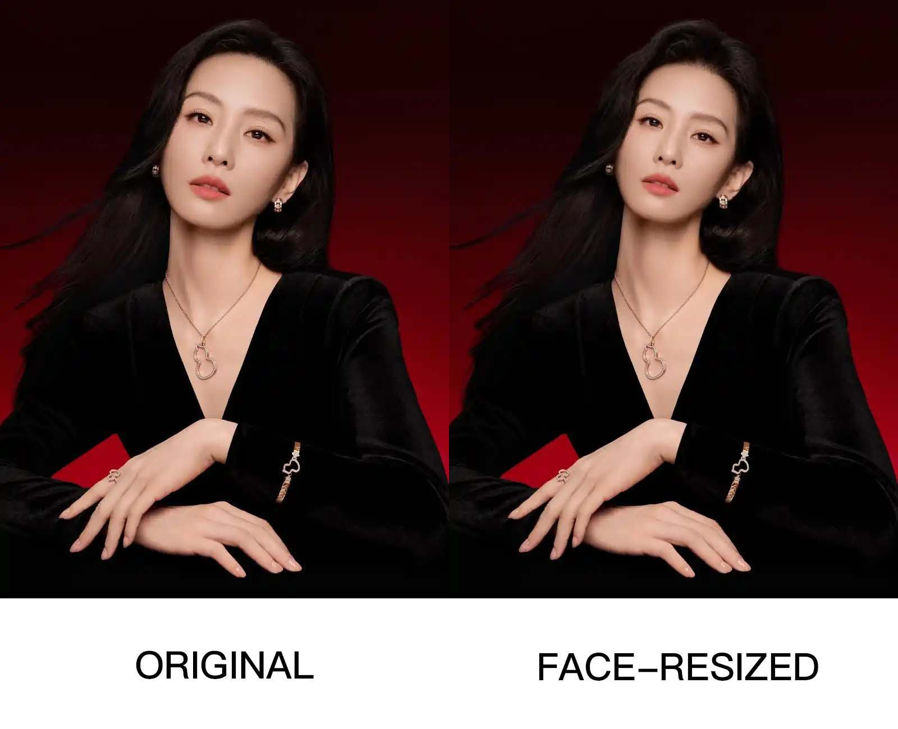

# WA Face Scale CLI

A tiny command-line tool for resizing and re-compositing a face onto an original image.

This is meant to solve a narrow problem similar to DeepFaceLab's face-scale merge adjustment:

> make the detected face slightly smaller or larger, then blend it back into the target image.

It is **not** a ComfyUI custom node. It is a standalone Python script.

## What it does

The script uses:

* MediaPipe FaceMesh for facial landmarks
* OpenCV for affine warping
* NumPy for image blending

Basic process:

1. Detect face landmarks in the source image.
2. Detect face landmarks in the target image.
3. Use eye distance and nose position to calculate scale, rotation, and placement.
4. Create a soft face-oval mask.
5. Optionally stretch pixels from just outside the original target face boundary into the shrink gap.
6. Warp the source face onto the target image.
7. Blend the result and save a PNG/JPG output.

## EXAMPLE




## Requirements

Use Python 3.12.

MediaPipe `0.10.21` is used because it still supports the old `mp.solutions.face_mesh` API.

Important:

Do **not** install MediaPipe with normal dependency resolution. Normal installation may pull large unnecessary packages such as `jax`, `jaxlib`, `opencv-contrib-python`, and `matplotlib`.

Use `--no-deps`.

## Installation

Create a venv:

```bash
python3.12 -m venv .venv
```

Install pip tools:

```bash
./.venv/bin/python -m pip install -U pip setuptools wheel
```

Install dependencies without automatic dependency resolution:

```bash
./.venv/bin/python -m pip install --no-deps --only-binary=:all: --prefer-binary -r requirements.txt
```

Verify:

```bash
./.venv/bin/python - <<'PY'
import mediapipe as mp
import cv2
import numpy as np

print("mediapipe:", mp.__version__)
print("has mp.solutions:", hasattr(mp, "solutions"))
print("face_mesh:", mp.solutions.face_mesh.FaceMesh)
print("opencv:", cv2.__version__)
print("numpy:", np.__version__)
PY
```

Expected:

```text
mediapipe: 0.10.21
has mp.solutions: True
```

## Usage

Example:

```bash
# The same command that produced the example above
./.venv/bin/python face_resize.py \
  --source original.jpg \
  --target original.jpg \
  --scale 0.92 \
  --mask-expand 80 \
  --feather 120 \
  --output output_face_scaled.png \
  --debug-mask output_mask.png
```

Make the face smaller:

```bash
./.venv/bin/python face_resize.py \
  --source original.jpg  \
  --target original.jpg  \
  --scale 0.92 \
  --output output_smaller.png
```

Make the face smaller and stretch the surrounding boundary inward:

```bash
./.venv/bin/python face_resize.py \
  --source original.jpg  \
  --target original.jpg  \
  --mode stretch \
  --scale 0.92 \
  --stretch 1.0 \
  --output output_smaller_stretched.png
```

Tune the stretch width differently on each side of the face:

```bash
./.venv/bin/python face_resize.py \
  --source original.jpg  \
  --target original.jpg  \
  --mode stretch \
  --scale 0.92 \
  --stretch 1.0 \
  --stretch-left 0.5 \
  --stretch-right 1.25 \
  --stretch-top 1.0 \
  --stretch-bottom 0.25 \
  --output output_directional_stretch.png
```

Make the face larger:

```bash
./.venv/bin/python face_resize.py \
  --source original.jpg  \
  --target original.jpg  \
  --scale 1.08 \
  --output output_larger.png
```

Make the face larger and compact the surrounding boundary outward:

```bash
./.venv/bin/python face_resize.py \
  --source original.jpg  \
  --target original.jpg  \
  --mode stretch \
  --scale 1.08 \
  --stretch 1.0 \
  --output output_larger_compacted.png
```

Tune the blend differently on each side of the face:

```bash
./.venv/bin/python face_resize.py \
  --source original.jpg \
  --target original.jpg \
  --scale 0.92 \
  --mask-expand -2 \
  --mask-expand-top 6 \
  --mask-expand-bottom -4 \
  --feather 12 \
  --feather-top 28 \
  --feather-bottom 6 \
  --feather-gamma 1.3 \
  --output output_tuned.png \
  --debug-mask output_tuned_mask.png
```

Process every supported image in a folder:

```bash
./.venv/bin/python face_resize.py \
  --input-folder photos \
  --output-folder resized_photos \
  --scale 0.92
```

Batch mode processes images one by one. Each input photo is used as both the
source and target image, and the resized result is saved to the output folder
with the same filename.

Process nested folders too:

```bash
./.venv/bin/python face_resize.py \
  --input-folder photos \
  --output-folder resized_photos \
  --recursive \
  --scale 1.08
```

## Parameters

```text
--source        Source face image.
--target        Target/original image. Preferably the same photo as source but you can play around with a new photo to achieve a superficial face swap effects, although this won't bring you the fancy deepfake result that tools like facefusion is known for.
--output        Output image path.
--input-folder  Folder of images to process one by one.
--output-folder Folder to save batch results.
--mode          composite|stretch. composite uses the regular feathered paste. stretch ignores mask expansion and feathering for a pure geometry pass.
--scale         Face scale multiplier. Example: 0.92 smaller, 1.08 larger.
--offset-x      Move pasted face horizontally.
--offset-y      Move pasted face vertically.
--mask-expand   Expand or shrink the face mask. Negative values shrink.
--mask-expand-left
--mask-expand-right
--mask-expand-top
--mask-expand-bottom
                Override mask expansion for one face-local side.
--feather       Blur/soften the mask edge. The default gaussian curve uses OpenCV GaussianBlur.
--feather-left
--feather-right
--feather-top
--feather-bottom
                Override feather width for one face-local side.
--feather-curve gaussian|linear|smoothstep|power
                Select the feather falloff curve.
--feather-gamma Adjust the softened mask after feathering. > 1 tightens the edge, < 1 softens it.
--stretch      Scale-aware boundary warp factor. 1.0 means use an outside source band as wide as the scale-created difference. When shrinking, stretch that outside band inward into the exposed gap. When enlarging, compact a source interval outward around the enlarged face edge.
--stretch-left
--stretch-right
--stretch-top
--stretch-bottom
                Override stretch or compact factor for one face-local side.
--stretch-feather
                Optional blur/soften for the stretch or compact seam in composite mode. Ignored in stretch mode.
--stretch-gamma Adjust the stretch or compact mask after feathering in composite mode. Ignored in stretch mode.
--stretch-mode box|radial
                Select the stretch mapping. box is the default and uses a face-local box aligned to the eye-to-eye axis and forehead-to-chin direction. radial is the older center-ray mapping.
--no-rotate     Disable rotation alignment.
--color-match   Apply simple color matching.
--debug-mask    Save the final warped mask for debugging.
--debug-mask-folder Save final warped masks for batch debugging.
--recursive     Process images in nested folders.
```

Directional values override only their side. If a directional value is omitted,
the script uses the global `--mask-expand`, `--feather`, or `--stretch` value
for that side.

Directional mask, feather, and stretch controls are face-local, not raw
image-local. `left` and `right` follow the eye-to-eye axis. `top` and `bottom`
follow the perpendicular forehead-to-chin axis. If the head is tilted, these
directions tilt with the face. The default `--stretch-mode box` uses this same
face-local axis system, not the raw image horizontal and vertical axes.

## Practical notes

Enlarging a face is usually easier because the larger pasted face covers the original face underneath.

Shrinking a face is harder because the old face boundary may still be visible around the smaller overlay. Use `--mode stretch --stretch 1.0` to calculate the face-local box difference between the original face boundary and the scaled-down face boundary, sample an equally wide band outside the original boundary, and stretch that outside band inward. With `--stretch 1.0`, the outside band is stretched over the outside band plus the exposed gap, so the affected band becomes twice the difference width. This stretches nearby hair, ears, shadow, skin-edge, and background texture inward; it does not invent new detail.

When enlarging a face with `--mode stretch --stretch 1.0`, the same control calculates the outward difference between the original and enlarged boundaries, then compacts the corresponding surrounding target pixels outward around the enlarged face boundary.

In `--mode stretch`, `--mask-expand`, `--feather`, directional feather options, `--stretch-feather`, and `--stretch-gamma` are ignored. The output is a pure geometry pass plus a hard-mask paste of the scaled face. In the default `--stretch-mode box`, that geometry is aligned to the face-local axes. In `--mode composite`, those controls keep their regular blending behavior.

Small to moderate shrinking usually works best. Large shrinking can make the stretched band look smeared or rubbery, so tune `--stretch` together with `--scale`.

## What this is not

This is not a face swap model.

This is not a face restoration model.

This is not a ComfyUI custom node.

This is a lightweight face-geometry compositing script.

## Why install with `--no-deps`?

`mediapipe==0.10.21` declares many dependencies that are not needed for this small script. A normal install may download huge packages such as `jaxlib`.

Use:

```bash
./.venv/bin/python -m pip install --no-deps -r requirements.txt
```

Do not use:

```bash
./.venv/bin/python -m pip install -r requirements.txt
```

## Troubleshooting

If Python says a module is missing, install only that missing module with `--no-deps`.

Example:

```bash
./.venv/bin/python -m pip install --no-deps missing-package-name
```

Do not reinstall `mediapipe` with normal dependency resolution.
